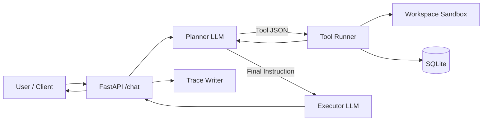

# Architecture Overview



## Design Principles

- **Planner/executor separation**: Lightweight planning model (Ollama) selects tools; stronger executor (OpenAI) synthesizes responses
- **Tool execution is sandboxed and allowlisted**: File operations constrained to workspace; shell commands restricted to safe read-only operations
- **Memory is explicit, gated, and project-scoped**: Saves require user intent keywords; memories isolated per workspace with global fallback
- **Traces provide full observability**: Every request logged with routing decisions, memory usage, and tool calls
- **Model routing is policy-driven**: Configuration-based model selection without code changes

## Components

### 1. FastAPI `/chat` Endpoint
- Accepts user messages with `thread_id`
- Computes `project_id` from workspace path
- Retrieves project-scoped memories
- Orchestrates planner → executor flow

### 2. Planner LLM (Ollama/llama3.1:8b)
- Analyzes user request
- Selects appropriate tools
- Generates tool arguments as JSON
- Iterates until all information gathered
- Cost-optimized: 80%+ of inference

### 3. Tool Runner
- Validates tool calls against allowlist
- Enforces workspace sandbox for file operations
- Executes safe shell commands
- Handles `save_memory` gating

### 4. SQLite Database
- `messages`: Conversation history by thread
- `memories`: Project-scoped and global memories
- Atomic transactions for consistency

### 5. Workspace Sandbox
- All file operations constrained to `cwd`
- Path traversal prevention
- Read/write/list operations

### 6. Executor LLM (OpenAI/gpt-4o-mini)
- Receives tool results + user context
- Synthesizes natural language response
- Quality-focused: User-facing output only

### 7. Trace Writer
- JSON logs for every request
- Captures routing decisions, memory usage, tool calls
- Stored in `traces/` for debugging

## Key Design Decisions

### Planner/Executor Split
**Rationale**: Separate reasoning (cheap) from synthesis (expensive)

**Benefits**:
- 80%+ cost reduction (Ollama local vs OpenAI cloud)
- Faster iteration during tool selection
- Higher quality final responses

### Project-Scoped Memory
**Rationale**: Prevent memory pollution across workspaces

**Implementation**:
- SHA1 hash of resolved workspace path = `project_id`
- SQL: `WHERE (project_id = ? OR project_id IS NULL)`
- Priority: Project memories → Global memories

### Memory Gating
**Rationale**: Prevent accidental/malicious memory saves

**Implementation**:
- Keyword detection: "remember", "from now on", "always"
- Executed in planner loop, not by user-controlled tools

### Routing Policy
**Rationale**: Cost/capability tuning without code changes

**Implementation**:
- JSON config file: `routing_policy.json`
- Primary/fallback models per component
- Rule-based "strong executor" triggers

## Execution Example

```
1. User: "List files and remember to use bullet points"
2. API computes project_id: eec7d0505588
3. API retrieves memories (0 project, 3 global)
4. Planner receives: user message + memory context
5. Planner calls: list_files()
6. Tool executes: returns ["app.py", "tools.py", ...]
7. Planner detects: "remember" keyword
8. Planner calls: save_memory(kind="preference", text="Use bullet points", scope="project")
9. Tool saves: memory with project_id=eec7d0505588
10. Planner sends: final instruction to executor
11. Executor formats: "Here are the files:\n- app.py\n- tools.py"
12. API returns: assistant_message + tool_calls + status
13. Trace written: traces/trace_1735075432.json
```

## Security Boundaries

| Component | Constraint | Enforcement |
|-----------|-----------|-------------|
| File operations | Workspace-scoped | Path validation in `tools.py` |
| Shell commands | Allowlist only | Keyword check in `run_shell_command` |
| Memory saves | Gated by intent | Keyword detection in planner loop |
| Model access | Policy-driven | Routing config + fallback logic |

## Data Flow

```
User Message
  → Thread History (SQLite)
  → Memory Retrieval (project_id filter)
  → Planner Context (system + memories + history)
  → Tool Execution (sandboxed)
  → Executor Synthesis
  → Response + Trace
```

## Scalability Considerations

- **SQLite**: Single-instance only. For multi-server, migrate to PostgreSQL
- **Traces**: Grow unbounded. Add rotation policy or S3 archival
- **Memory**: Linear scan on retrieval. Add vector embeddings for large datasets
- **Routing**: Static config. For dynamic routing, add model performance metrics

## Future Extensions

1. **Vector Memory**: Semantic search over long-term knowledge
2. **Multi-Agent**: Parallel tool execution with task decomposition
3. **Streaming**: SSE for token-by-token executor output
4. **Caching**: LRU cache for repeated tool results
5. **Webhooks**: Async notifications for long-running tasks
