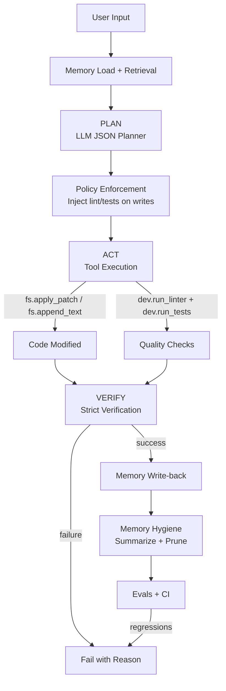

# AI Assistant


A production-grade AI coding assistant with tool chaining, intelligent memory, and multi-model routing. Built with FastAPI and designed for workspace-aware development tasks.

## Architecture (trustworthy agent design)

This project is an AI agent platform built to be **safe-by-default** and **measurable**.

### Core flow
1. **Memory preload + deterministic retrieval**
2. **PLAN** (LLM generates strict JSON plan)
3. **Policy enforcement** (auto-inject lint/tests after any write)
4. **ACT** (schema-validated tool execution)
5. **VERIFY** (proof-based; requires passing checks on code changes)
6. **Memory write-back** (only after verified success)
7. **Memory hygiene** (bounded growth + pruning)
8. **Evals + CI** (regression detection)

### Guardrails
- **BUILDER vs REVIEWER** modes (authority separation)
- **Unified-diff patching** for edits (reviewable, fail-fast)
- **Strict verification** blocks false success
- **Deterministic eval suite** ensures stability over time

## Quick demo

### 1) Install
```bash
pip install -r requirements.txt
pip install python-dotenv requests
```

### 2) Configure OpenAI

Create a `.env` file in repo root:
```ini
OPENAI_API_KEY=...
OPENAI_MODEL=gpt-4-mini
```

### 3) Run the LLM agent (read-only)
```bash
python -m agent.smoke_test_llm_agent
```

### 4) Run deterministic evals (quality gate)
```bash
python -m evals.run_evals
```

Expected: **9 passed, 0 failed**

### 5) Inspect a trace
```bash
python -c "import json; print(json.dumps(json.load(open('traces/1766594838_4e2d3157-dbbf-4632-96da-732c019b71ac.json')), indent=2))" | head -50
```

See: Planning → Tool execution → Verification → Memory write-back

### 6) Check memory hygiene
```bash
cat memory/decisions.md
```

Bounded growth (max 30 decisions, 25k chars)

## Proof (regression-resistant)
- CI runs deterministic evals on every push/PR.
- Evals are LLM-free to prevent flaky results.
- Any regression fails CI automatically.

## Architecture diagram



## Features

- **Tool Chaining**: Planner/executor architecture enables multi-step reasoning and complex workflows
- **Multi-Model Routing**: Policy-driven model selection (Ollama for planning, OpenAI for execution) with automatic fallback
- **Project-Scoped Memory**: Memories isolated by workspace with global fallback for shared knowledge
- **Memory Gating**: Explicit user intent required for saving memories ("remember this", "from now on")
- **Comprehensive Tracing**: JSON traces capture routing decisions, memory usage, and execution flow
- **Workspace Sandbox**: All file operations constrained to current working directory
- **Command Allowlist**: Shell commands restricted to safe, read-only operations
- **SQLite Persistence**: Thread-based conversations and intelligent memory ranking

## Quickstart

### Installation

```powershell
# Clone or create project directory
cd ai_assistant

# Create virtual environment
python -m venv .venv

# Activate (Windows)
.\.venv\Scripts\Activate.ps1

# Install dependencies
pip install fastapi uvicorn openai requests

# Create .env file
@"
OPENAI_API_KEY=your_key_here
OPENAI_BASE_URL=https://api.openai.com/v1
OLLAMA_BASE_URL=http://localhost:11434/v1
LLM_MODE=live
"@ | Out-File -FilePath .env -Encoding utf8

# Initialize and run
.\run.ps1
```

**Linux/Mac:**
```bash
python -m venv .venv
source .venv/bin/activate
pip install fastapi uvicorn openai requests
# Create .env, then:
python bootstrap.py
uvicorn app:app --host 0.0.0.0 --port 8000
```

Server starts at `http://localhost:8000` (API docs at `/docs`)

## Configuration

### Environment Variables (.env)

```ini
# OpenAI Configuration
OPENAI_API_KEY=sk-...
OPENAI_BASE_URL=https://api.openai.com/v1

# Ollama Configuration (local models)
OLLAMA_BASE_URL=http://localhost:11434/v1

# Mode: "live" or "mock" (mock for testing)
LLM_MODE=live
```

### Routing Policy (routing_policy.json)

Controls which models handle planning vs execution:

```json
{
  "planner": {
    "primary": {"provider": "ollama", "model": "llama3.1:8b"},
    "fallback": {"provider": "openai_compat", "model": "gpt-4o-mini"}
  },
  "executor": {
    "primary": {"provider": "openai_compat", "model": "gpt-4o-mini"},
    "fallback": {"provider": "ollama", "model": "llama3.1:8b"}
  },
  "rules": {
    "use_strong_executor_if": {
      "min_user_chars": 600,
      "keywords": ["architecture", "refactor", "design", "optimize", "security"]
    }
  }
}
```

**Cost optimization**: Local Ollama for planning, OpenAI for execution only when needed

## API Usage

### POST /chat

Send a message and receive assistant response with tool execution:

```bash
curl -X POST http://localhost:8000/chat \
  -H "Content-Type: application/json" \
  -d '{
    "thread_id": "my-session",
    "user_message": "List files in the current directory"
  }'
```

**Response:**
```json
{
  "assistant_message": "Here are the files:\n- app.py\n- tools.py\n- README.md",
  "used_memories": [],
  "tool_calls": [
    {
      "tool": "list_files",
      "args": {},
      "result": "app.py\ntools.py\nREADME.md"
    }
  ],
  "status": "ok"
}
```

### Save Project-Scoped Memory

```bash
curl -X POST http://localhost:8000/chat \
  -H "Content-Type: application/json" \
  -d '{
    "thread_id": "session1",
    "user_message": "From now on, always use strict typing in Python"
  }'
```

The assistant will use `save_memory` with `scope="project"` to isolate this preference to the current workspace.

## Safety Model

### Workspace Sandbox

- All file operations (`list_files`, `read_file`, `write_file`) are constrained to `cwd`
- Attempts to access `../` or absolute paths outside workspace are blocked
- Directory traversal attacks prevented

### Command Allowlist

`run_shell_command` only allows safe, read-only operations:

- `ls`, `dir`, `cat`, `head`, `tail`, `grep`, `find`
- `git status`, `git log`, `git diff`
- `python --version`, `node --version`

**Blocked**: `rm`, `sudo`, `curl`, network commands, package installers

### Memory Gating

`save_memory` requires explicit user intent with keywords:
- "remember this"
- "from now on"
- "always"
- "save this"
- "store this"

Prevents accidental or unwanted memory pollution.

## Architecture

### Planner/Executor Split

1. **Planner** (lightweight model): Analyzes request, selects tools, provides arguments
2. **Executor** (stronger model): Synthesizes tool results into natural language response

Benefits:
- Cost savings (80%+ of tokens use cheaper planning model)
- Speed (Ollama local inference)
- Quality (OpenAI for final user-facing responses)

### Project-Scoped Memory

Each workspace gets a unique `project_id` (SHA1 hash of resolved path). Memories are stored with scope:

- `scope="project"`: Only visible in that workspace
- `scope="global"`: Visible everywhere (default)

**Query priority**: Project memories → Global memories → Ranked by keyword/importance/recency

### Trace System

Every request creates `traces/trace_<timestamp>.json` with:
- Routing decisions (which models used)
- Memory injection (IDs, scopes)
- Tool calls with timing
- Planner/executor iterations

Invaluable for debugging model behavior and optimizing cost.

## Available Tools

| Tool | Description | Safety |
|------|-------------|--------|
| `list_files` | List directory contents | Workspace-scoped |
| `read_file` | Read file contents | Workspace-scoped |
| `write_file` | Create or overwrite file | Workspace-scoped |
| `run_shell_command` | Execute safe commands | Allowlist enforced |
| `save_memory` | Store preference/fact | Gated (explicit intent) |

## Troubleshooting

### Rate Limits (OpenAI)

**Symptom**: `RateLimitError` or 429 responses

**Solution**: 
1. Use Ollama for both planner and executor in `routing_policy.json`
2. Increase `rules.min_user_chars` to 1000+ to use strong executor less often
3. Add retry logic with exponential backoff

### Ollama Not Running

**Symptom**: `Connection refused` to `localhost:11434`

**Solution**:
```bash
# Start Ollama
ollama serve

# Pull required model
ollama pull llama3.1:8b
```

Verify: `curl http://localhost:11434/v1/models`

### Memory Not Loading

**Symptom**: Memories saved but not appearing in context

**Check**:
1. Project ID: `python -c "from app import compute_project_id; print(compute_project_id('.'))"` 
2. Database: `sqlite3 assistant.db "SELECT * FROM memories WHERE project_id IS NOT NULL"`
3. Trace file: `traces/trace_*.json` → check `memories` array in `run_start` event

**Common issue**: Working directory changed between save and retrieve (different `project_id`)

### Server Hangs on Request

**Symptom**: Request times out, server becomes unresponsive

**Causes**:
1. Ollama model not loaded (first request loads into memory)
2. Infinite planner loop (misconfigured tools)
3. Network timeout to OpenAI

**Debug**:
```bash
# Check server logs for last output
# Look for: ">>> /chat START (project_id: ...)"

# Test with mock mode
$env:LLM_MODE='mock'
.\run.ps1

# Validate routing policy syntax
python -c "import json; print(json.load(open('routing_policy.json')))"
```

### Trace Files Growing Large

**Symptom**: `traces/` directory consuming significant disk space

**Solution**:
```powershell
# Keep last 100 traces
Get-ChildItem traces\trace_*.json | 
  Sort-Object LastWriteTime -Descending | 
  Select-Object -Skip 100 | 
  Remove-Item

# Or disable tracing
# In app.py: enable_trace=False in run_agent_loop call
```

## Development

### Running Tests

```powershell
# Mock mode tests (no network calls)
$env:USE_MOCK_LLM='1'
python test_routing.py
python test_validation.py
python test_isolation_simple.py
```

### Adding New Tools

1. Define function in `tools.py`:
```python
def my_tool(arg1: str, arg2: int = 10) -> str:
    """Tool description for LLM."""
    return f"Result: {arg1} * {arg2}"
```

2. Register in `app.py` TOOLS dict:
```python
TOOLS = {
    "my_tool": my_tool,
    # ... existing tools
}
```

3. Tool becomes available to planner automatically via function signature inspection

### Modifying Routing Policy

Edit `routing_policy.json` and restart server. No code changes needed.

**Example**: Use GPT-4 for complex requests:
```json
{
  "executor": {
    "primary": {"provider": "openai_compat", "model": "gpt-4"}
  },
  "rules": {
    "use_strong_executor_if": {
      "min_user_chars": 300,
      "keywords": ["complex", "detailed", "architecture"]
    }
  }
}
```

## License

MIT
